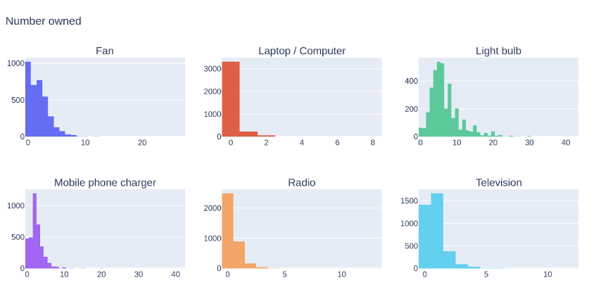

# AI For Enegy Access (AI4EA)
### Reiner Lemoine Instut and Atlas AI for Lacuna Fund

This repository presents the context, code, and results of the Machine Learning (ML) approach to AI For Energy Access (AI4EA) inference component of the initiative.

## Objective

We will use the PeopleSun georeferenced survey responses (restricted access) that contains a reported census of appliances. The applicance counts are a predictor of electricity consumption. The appliance counts will be used to train a machine learning (ML) model to predict, i.e. infer, the estimated appliance types and number for out of sample areas.

Since the survey data were collected in specific zones in Nigeria, "out of sample" in this case implies other inhabited, settled communities in Nigeria and beyond.

In line with the broader goal of the project we will use the model to estimate appliance types and counts in four other countries.

## Summary Exploratory Data Analysis

While many different EDA were performed, some main insights are synthesized:
- the distributions of the number of appliances owned by HH are all right-skewed, i.e. most of the probability weight is in the lower end of the distribution
- for appliances such as laptops, radios, and televisions in particular it might be appropriate to treat the data as categorical, because most HHs either have none or one of each of these. 
- outliers may need to be handled through winsorization. for example, some HHs are reported to have 40 phone chargers, which needs to be handled in label pre-processing

### Map setup

sudo apt update
sudo apt install postgresql postgis gdal-bin